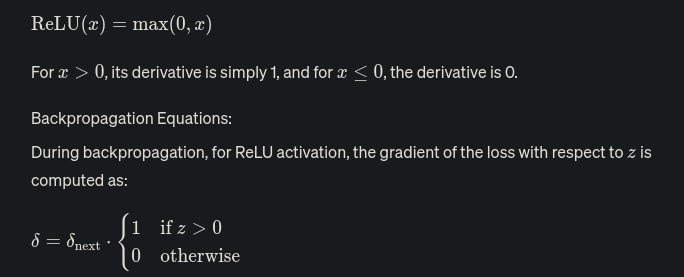
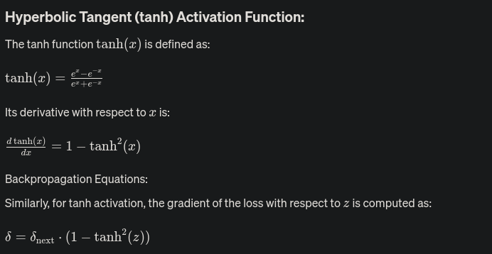
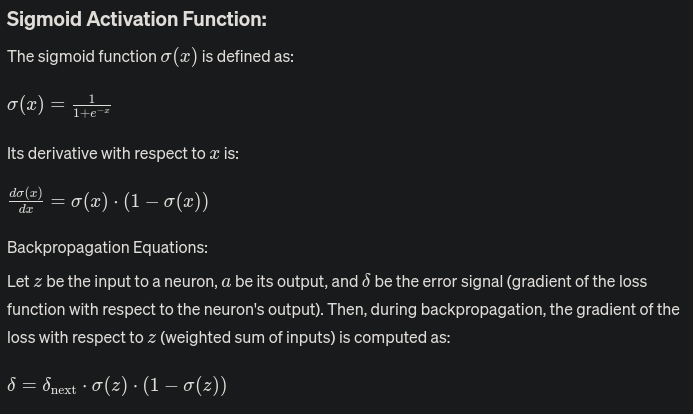
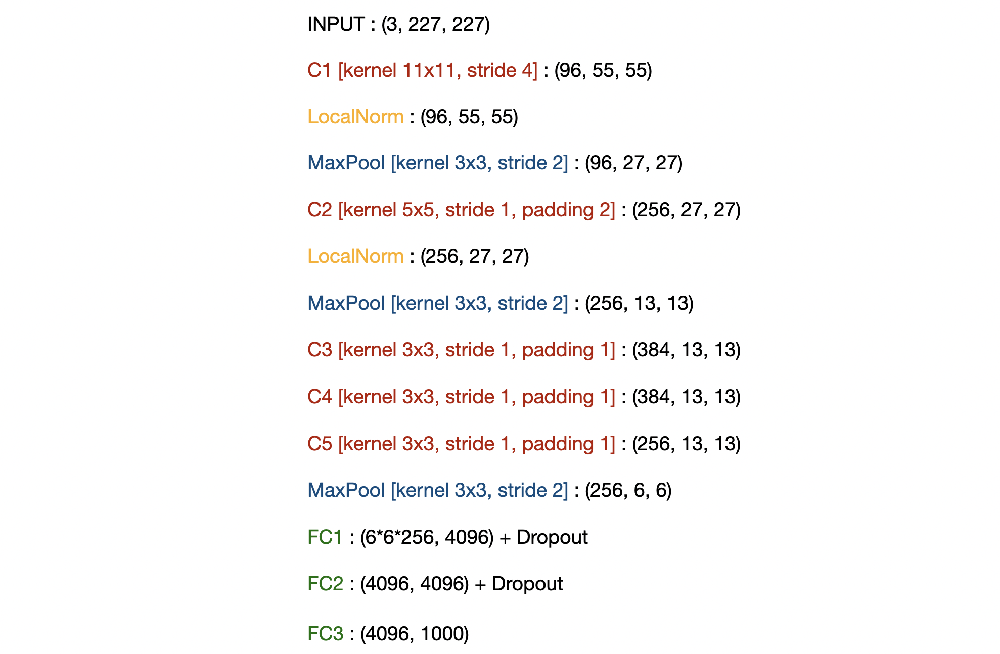

# AlexNet Notes

* Large CNN's outperform other techniques significantly on large datasets like ImageNet
* CNN's utilize the GPU

## Activation Function and thier Impacats on training

* ReLU speeds up computation significantly
  Relu Backpropagation:
    
  tanh Backpropagation:
    
  sigmoid Backpropagation:
    

## Max Pooling

* Overlap Max Pooling

## Normalization

1. Local Response Normalization (LRN):

    LRN is a technique used to normalize activations within a single layer of a neural network. It operates on a local neighborhood of activations within the same feature map. The normalization is applied independently to each neuron, where the activation of each neuron is divided by the sum of the squares of its own value and those of its nearby neighbors.

2. Batch Normalization (BN):

    Batch Normalization, on the other hand, operates at the batch level. It normalizes the activations of each layer across the entire batch, not just within a single sample or within a single feature map. BN computes the mean and variance of each feature map over the batch and then normalizes the activations using these statistics. This helps to stabilize and speed up the training process by reducing internal covariate shift.

3. Comparison:

    Scope: LRN operates within a single layer and considers only local neighborhoods, while BN operates across the entire batch.
    Normalization: LRN normalizes within each feature map, while BN normalizes across feature maps and batch examples.
    Effectiveness: BN has been found to be more effective in stabilizing and accelerating training compared to LRN, especially in deep networks.
    Regularization: BN also acts as a regularizer, reducing the need for other regularization techniques like dropout.

In summary, while both LRN and BN aim to improve training performance, Batch Normalization is more widely used due to its effectiveness and ease of implementation. It has largely replaced LRN in modern neural network architectures.

## OverFitting

* Overfitting can be combated using different techniques like:
   1. Dropout
   2. Data augmentation (CropPad, Horizontal Flip)

## Architecture

## Questions in My mind

* Using PCA to generate dataset.
