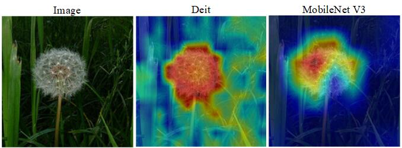

## Category activation map visualization

- Provides `src/tools/vis_cam.py` tool to visualize category activation maps. Please use `pip install grad-cam` to install dependencies, version ≥1.3.6
- Find the corresponding configuration file under `Awesome-Backbones/models/`
- Modify the ckpt path of test in data_cfg to the trained weights
Currently supported methods are:

| Method | What it does |
|:----------:|:----------:|
| GradCAM | Weight 2D activations using average gradient |
| GradCAM++ | Like GradCAM, but uses second-order gradients |
| XGradCAM | Like GradCAM, but gradients are weighted by normalized activations |
| EigenCAM | First principal component using 2D activations (cannot distinguish classes, but seems to work well) |
| EigenGradCAM | Similar to EigenCAM, but supports category distinction and uses the first principal component of the activation \* gradient. It looks similar to GradCAM, but cleaner |
| LayerCAM | Use positive gradients to spatially weight activations, which has better results for shallow layers |


### **Command Line**

```bash
python tools/vis_cam.py \
    ${IMG} \
    ${CONFIG_FILE} \
    [--target-layers ${TARGET-LAYERS}] \
    [--preview-model] \
    [--method ${METHOD}] \
    [--target-category ${TARGET-CATEGORY}] \
    [--save-path ${SAVE_PATH}] \
    [--vit-like] \
    [--num-extra-tokens ${NUM-EXTRA-TOKENS}]
    [--aug_smooth] \
    [--eigen_smooth] \
    [--device ${DEVICE}] \
```

### **Explanation of all parameters**:

- `img`: target image path.
- `config`: The path to the model configuration file. Please pay attention to modifying the weight path of `data_cfg->test->ckpt` in the configuration file. This weight will be used for prediction.
- `--target-layers`: The name of the network layer being viewed. You can enter one or more network layers. If not set, the `norm` layer in the last `block` will be used.
- `--preview-model`: Whether to view all network layers of the model.
- `--method`: Category activation graph visualization method, currently supports `GradCAM`, `GradCAM++`, `XGradCAM`, `EigenCAM`, `EigenGradCAM`, `LayerCAM`, not case sensitive. If not set, defaults to `GradCAM`.
- `--target-category`: The target category to be viewed. If not set, the category detected by the model is used as the target category.
- `--save-path`: The path of the saved visualization image, which is not saved by default.
- `--eigen-smooth`: Whether to use principal components to reduce noise, not enabled by default.
- `--vit-like`: Whether it is a Transformer-based network similar to `ViT`
- `--num-extra-tokens`: The number of extra tokens channels for `ViT`-like networks. By default, `num_extra_tokens` of the backbone network is used.
- `--aug-smooth`: whether to use test-time enhancement
- `--device`: The computing device used, if not set, defaults to 'cpu'.

```{note}
When specifying `--target-layers`, if you do not know which network layers the model has, you can use the command line to add `--preview-model` to view all network layer names;
```

### **Example (CNN)**

1. Use different methods to visualize `MobileNetV3`. The default `target-category` is the result of model detection, and the default derived `target-layers` are used.

    ```bash
    python tools/vis_cam.py datasets/test/dandelion/14283011_3e7452c5b2_n.jpg models/mobilenet/mobilenet_v3_small.py
    ```

2. Specify the activation image renderings of different categories in the same image by giving the category index.

    ```bash
    python tools/vis_cam.py datasets/test/dandelion/14283011_3e7452c5b2_n.jpg models/mobilenet/mobilenet_v3_small.py --target-category 1
    ```

3. Use `--eigen-smooth` and `--aug-smooth` for better visualization.

    ```bash
    python tools/vis_cam.py datasets/test/dandelion/14283011_3e7452c5b2_n.jpg models/mobilenet/mobilenet_v3_small.py --eigen-smooth --aug-smooth
    ```

### **Example (Transformer)**

For Transformer-based networks, such as ViT, T2T-ViT and Swin-Transformer, features are flattened. In order to draw a CAM diagram, the `--vit-like` option needs to be specified so that the flattened feature restores a square feature map.

In addition to feature flattening, some ViT-like networks also add additional tokens. For example, classification tokens have been added to ViT and T2T-ViT, and distillation tokens have been added to DeiT. In these networks, the classification calculation is completed after the last attention module, and the classification score is only related to these additional tokens and has nothing to do with the feature maps. That is to say, the derivative of the classification score with respect to these feature maps is 0. Therefore, we cannot use the output of the last attention module as the target layer for CAM rendering.

Additionally, in order to remove these extra tokens to obtain the feature map, we need to know the number of these extra tokens. Almost all Transformer-based networks in MMClassification have the `num_extra_tokens` attribute. And if you want to apply this tool to a new or third-party network, and the network does not specify the `num_extra_tokens` attribute, you can use the `--num-extra-tokens` parameter to manually specify the number.

1. Use default `target-layers` for `Swin Transformer` for CAM visualization:

    ```bash
    python src/tools/vis_cam.py datasets/test/dandelion/14283011_3e7452c5b2_n.jpg models/swin_transformer/tiny_224.py --vit-like
    ```

2. Perform CAM visualization on `Vision Transformer(ViT)` (after testing, the default effect is almost the same without adding --target-layer):

    ```bash
    python src/tools/vis_cam.py datasets/test/dandelion/14283011_3e7452c5b2_n.jpg models/vision_transformer/vit_base_p16_224.py --vit-like --target-layers backbone.layers[-1].ln1
    ```

3. CAM visualization of `T2T-ViT`:

    ```bash
    python src/tools/vis_cam.py datasets/test/dandelion/14283011_3e7452c5b2_n.jpg models/t2t_vit/t2t_vit_t_14.py --vit-like --target-layers backbone.encoder[-1].ln1
    ```

