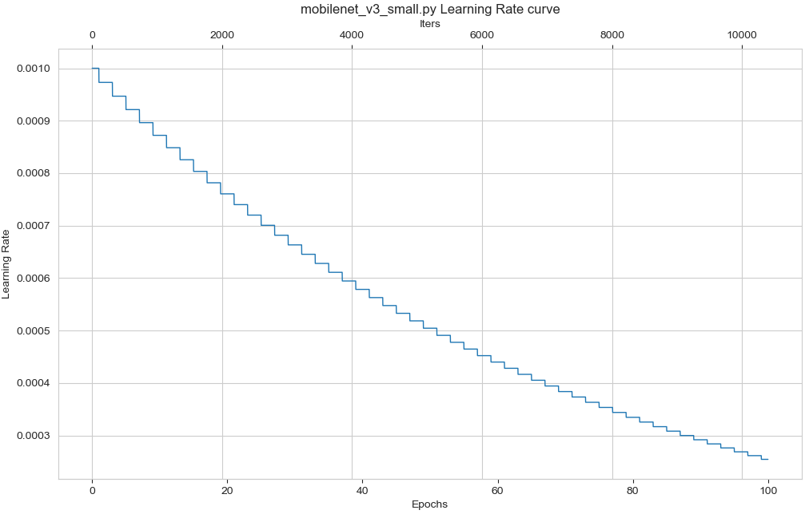
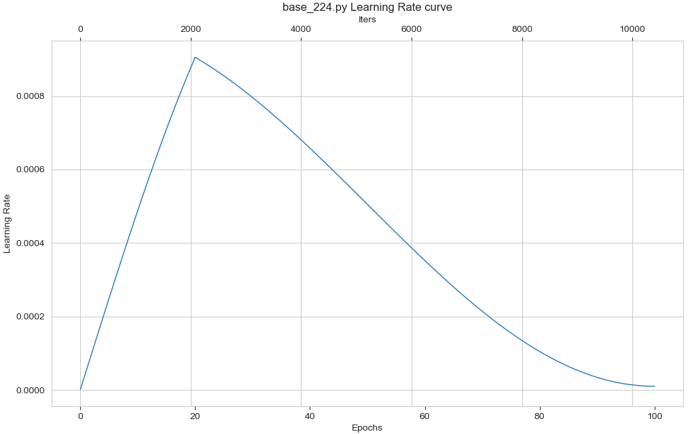

Learning rate strategy visualization
===========================

- Provides `src/tools/vis_lr.py` tool to visualize learning rates.

**Command Line**:

```bash
python src/tools/vis_lr.py \
    ${CONFIG_FILE} \
    [--dataset-size ${Dataset_Size}] \
    [--ngpus ${NUM_GPUs}] \
    [--save-path ${SAVE_PATH}] \
    [--title ${TITLE}] \
    [--style ${STYLE}] \
    [--window-size ${WINDOW_SIZE}] \
```

**Explanation of all parameters**:

- `config`         : The path to the model configuration file.
- `--dataset-size` : The size of the data set**Example Step**:. If specified, `datas/train.txt` will be skipped and this size will be used as the dataset size, defaulting to the size of the resulting dataset using `datas/train.txt`.
- `--ngpus`        : The number of GPUs used.
- `--save-path`    : The path of the saved visualization image, which is not saved by default.
- `--title`        : The title of the visualization image, which defaults to the configuration file name.
- `--style`        : The style of the visual image, the default is `whitegrid`.
- `--window-size`  : Visualization window size, if not specified, defaults to `12*7`. If specified, follow the format `'W*H'`.

```{note}

Some datasets are time-consuming in the parsing and annotation phase. You can directly specify the size of the dataset with `dataset-size` to save time.
```

**Example Step**:

```bash
python src/tools/vis_lr.py configs/mobilenet/mobilenet_v3_small.py
```



**Example Cos**:

```bash
python src/tools/vis_lr.py configs/swin_transformer/base_224.py
```


